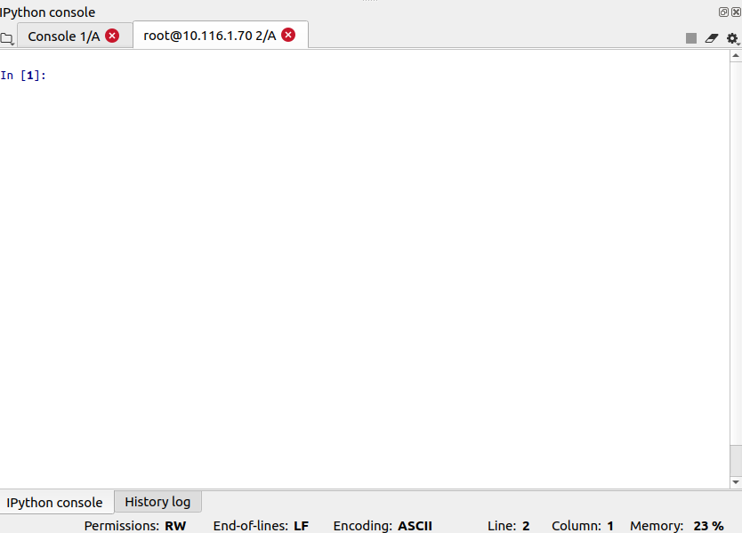

# Spyder

This page demonstrates how to run the spyder python IDE in your cluster.

## Login to your account

1.) Login to your account on the cluster.

2.) Load the "conda" module.

```
module load conda
```

3.) Get your jupyter runtime directory by:

```
jupyter --runtime-dir
```


4.) Launch a spyder kernel using the following command

```
python3 -Xfrozen_modules=off -m spyder_kernels.console
```


Leave this terminal running on your login. Also, the ".json" file is been shown after the "--existing".

5.) Open a new terminal on your local machine and copy the ".json" file to your system. Copy it on a folder you can keep track of.

In this example, the runtime directory is as shown in Figure 1, "/root/.local/share/jupyter/runtime". Using scp, we copy to our system. The ".json" for this example is "kernel-856702.json".

```
scp root@10.116.1.70:/root/.local/share/jupyter/runtime/kernel-856702.json .
```

Usually this should be

```
scp yourid@10.116.1.70:runtime_directory/kernel-$$$$$.json .
```

We kept this kernel file on home directory for easy access. You can keep it in any directory.

6.) Open Spyder on your machine and go the "Consoles" on the the topdown panel.


Here, select "Connect to an existing kernel". We get the following window.


4.) In the "Kernel ID/Connection file" browse and select the ".json" file which we have copied previously.


5.) Select the "This is a remote kernel(via SSH)". Fill in the "Hostname" and "password" of your login in the cluster.


Select Ok, the kernel is now connected.



The kernel is connected remotely to the cluster through your login.

Note: You will have to repeat this procedure each time you need to access spyder remotely.
